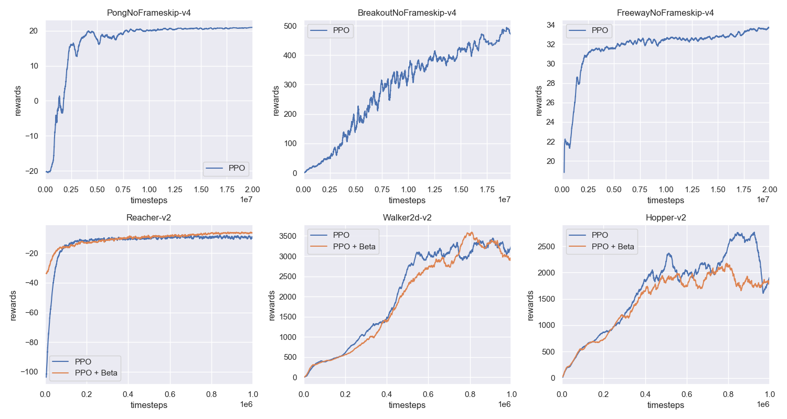

# Proximal Policy Optimization (PPO)
This is a pytorch-version implementation of [Proximal Policy Optimisation(PPO)](https://arxiv.org/abs/1707.06347). In this code, the actions can also be sampled from the beta distribution which could improve the performance. The paper about this is: [The Beta Policy for Continuous Control Reinforcement Learning](https://www.ri.cmu.edu/wp-content/uploads/2017/06/thesis-Chou.pdf)

## Requirements
- python 3.5.2
- openai-gym
- mujoco-1.50.1.56
- pytorch-0.4.0
## Installation
Install OpenAI Baselines (**the openai-baselines update so quickly, please use the older version as blow, will solve in the future.**)
```bash
# clone the openai baselines
git clone https://github.com/openai/baselines.git
cd baselines
git checkout 366f486
pip install -e .

```

## Instruction to run the code
the `--dist` contains `gauss` and `beta`. 
### Train the Network with Atari games:
```bash
python train_atari.py --lr-decay --cuda(if you have a GPU, you can add this flag)

```
### Test the Network with Atari games
```bash
python demo_atari.py

```
### Train the Network with Mujoco:
```bash
python train_mujoco.py --num-workers=1 --nsteps=2048 --clip=0.2 --batch-size=32 --epoch=10 --lr=3e-4 --ent-coef=0 --total-frames=1000000 --vloss-coef=1 --cuda (if you have gpu)

```
### Test the Network with Mujoco
```bash
python demo_mujoco.py

```
### Download the Pre-trained Model
Please download them from the [Google Driver](https://drive.google.com/open?id=1ZXqRKwGI7purOm0CJtIVFXOZnmxqvA0p), then put the `saved_models` under the current folder.

## Results
### Training Performance

### Demo: Walker2d-v1
**Note:** the new-version openai-gym has problem in rendering, so I use the demo of `Walker2d-v1`  
**Tips**: when you watch the demo, you can press **TAB** to switch the camera in the mujoco.  


